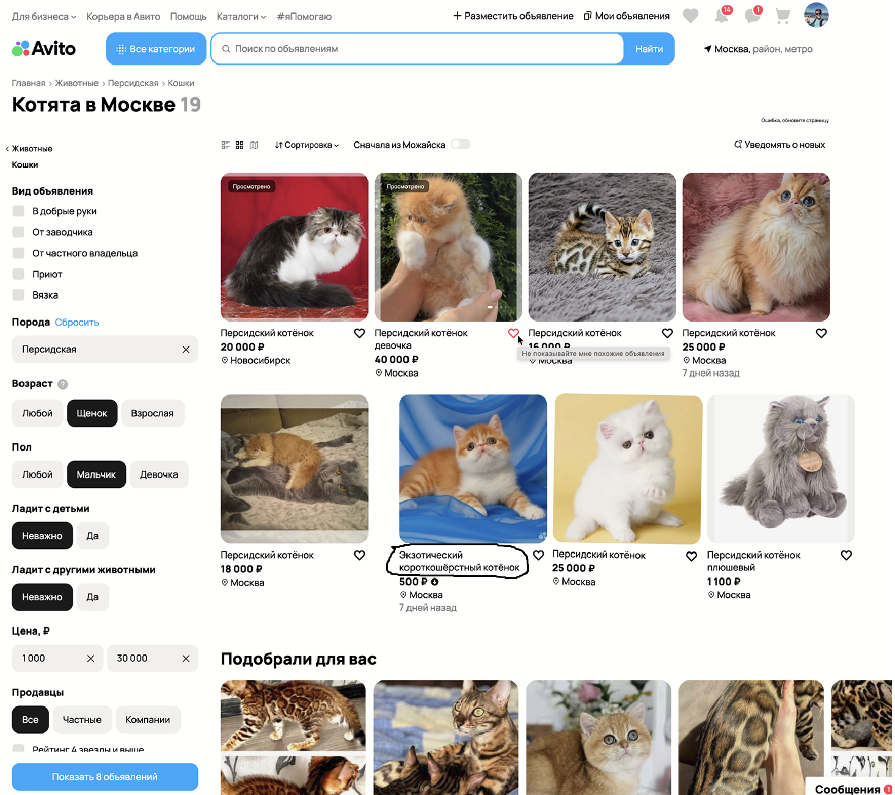
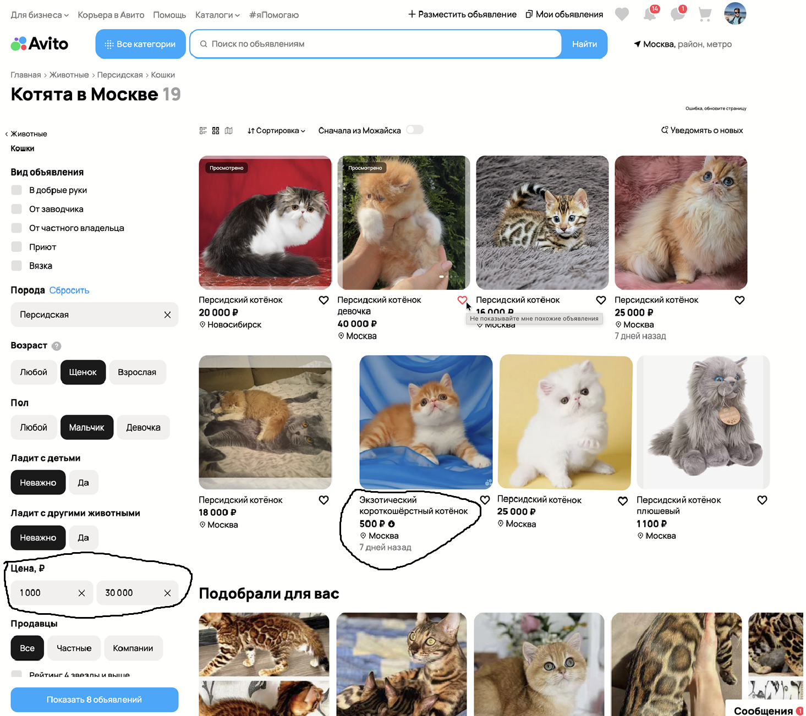
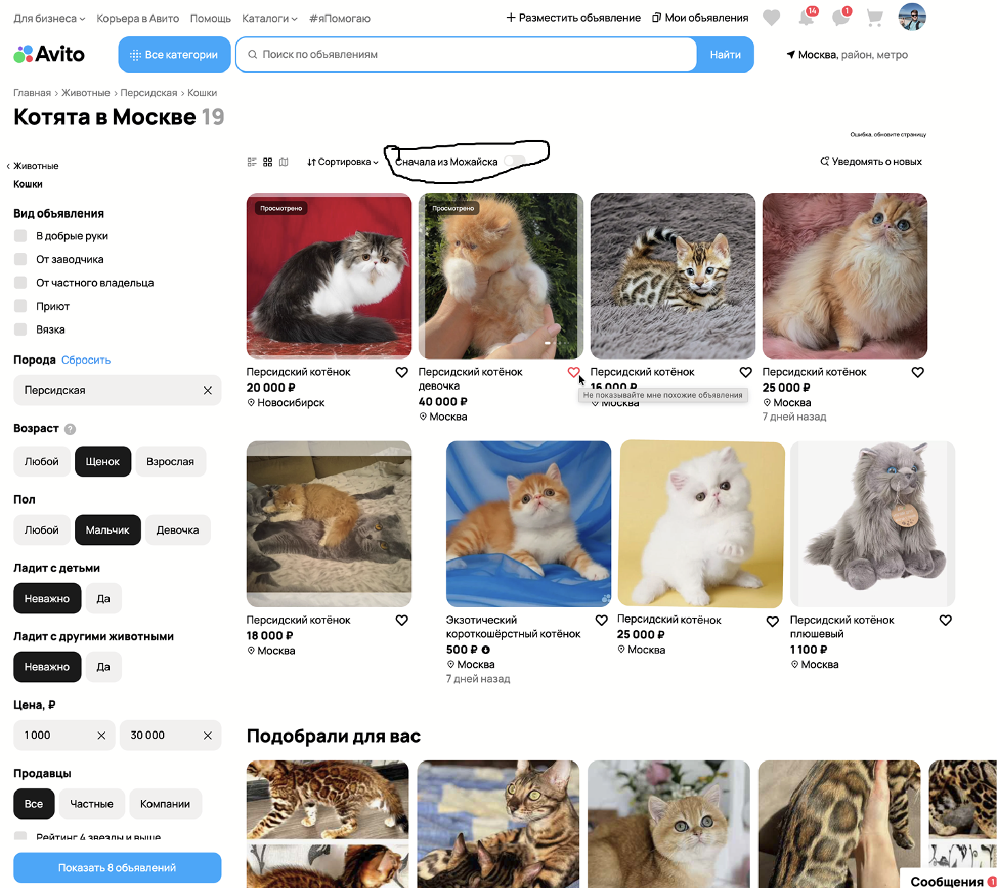
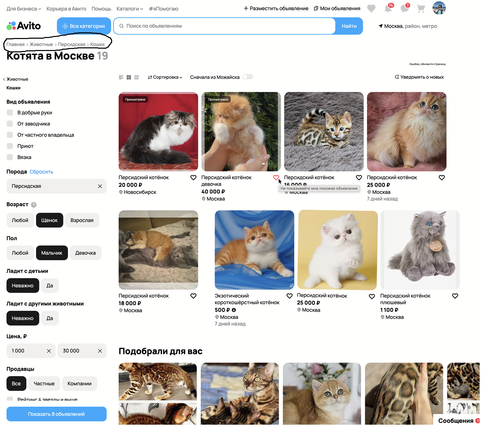

### Баг №1. Фильтр «Возраст» содержит пункт «Щенок» для поиска кошек

**Приоритет:** 
P1 (высокий)

**Описание:** 
В разделе «Котята в Москве» в фильтре «Возраст» присутствует значение «Щенок», что не соответствует категории «Кошки».

**Ожидаемый результат:** 
Для кошек должны быть варианты «Котёнок» и «Взрослая».

### Баг №2. Опечатка в тексте «Корьера в Авито»

**Приоритет:** P3 (низкий)  

**Описание:** 
В навигационной цепочке или заголовке написано «Корьера в Авито» вместо «Карьера в Авито». 

**Ожидаемый результат:** 
Корректное написание слова.

### Баг №3. Опечатка в названии породы «Экзотический короткошёлёстный»

**Приоритет:** 
P3 (низкий)  

**Описание:** 
В одном из объявлений порода указана с лишней буквой «ё»: «короткошёлёстный». 

**Ожидаемый результат:** 
Правильное название «Экзотический короткошёрстный».

### Баг №4. Нарушение фильтрации по цене

**Приоритет:** 
P1 (высокий)  

**Описание:** 
Установлен фильтр цены «от 1 000 ₽», однако в выдаче присутствует объявление с ценой 500 ₽. 

**Ожидаемый результат:** 
В результатах поиска отображаются только объявления с ценой ≥ 1 000 ₽.

### Баг №5. Несоответствие геолокации в подсказке

**Приоритет:** P2 (средний)  

**Описание:** Поиск выполняется в Москве, но при наведении на поле «Найти» появляется подсказка «Сначала из Можайска».  

**Ожидаемый результат:** 
Подсказка должна соответствовать текущей локации поиска (Москва) или отсутствовать.

### Баг №6. Некорректный текст при наведении на иконку сердечка

**Приоритет:** 
P2 (средний)  

**Описание:** 
При наведении на сердечко (добавление в избранное) у второй карточки товара всплывает подсказка «Не показывайте мне похожие объявления». Текст не соответствует действию (добавление в избранное) и вводит пользователя в заблуждение.  

**Ожидаемый результат:** 
Подсказка должна быть «Добавить в избранное» или аналогичная.

### Баг №7. Сообщение «Ошибка, обновите страницу» в интерфейсе

**Приоритет:** 
P1 (высокий)  

**Описание:** 
В нижней части страницы или в области выдачи отображается текст «Ошибка, обновите страницу». Это указывает на то, что часть данных не загрузилась или произошёл сбой при рендеринге компонентов.  

**Ожидаемый результат:** 
Страница загружается корректно, сообщение об ошибке отсутствует. В случае временного сбоя пользователю должно быть предложено повторить попытку без постоянного отображения ошибки.

### Баг №8. Нарушение верхней границы фильтра по цене

**Приоритет:** 
P1 (высокий)  

**Описание:** 
Установлен фильтр цены «до 30 000 ₽», однако в выдаче присутствует объявление с ценой 40 000 ₽ (вторая карточка).

**Ожидаемый результат:** 
В результатах поиска отображаются только объявления с ценой ≤ 30 000 ₽.

### Баг №9. Отсутствие варианта «Нет» в фильтрах «Ладит с детьми» и «Ладит с другими животными»

**Приоритет:** 
P2 (средний)  

**Описание:** 
В фильтрах «Ладит с детьми» и «Ладит с другими животными» доступны только значения «Неважно» и «Да». Отсутствует вариант «Нет», который может быть важен для пользователей, ищущих животных без контакта с детьми или другими питомцами.  

**Ожидаемый результат:** 
В обоих фильтрах должны присутствовать три опции: «Неважно», «Да», «Нет».

### Баг №10. Некорректный порядок навигационной цепочки

**Приоритет:** 
P3 (низкий)

**Описание:** 
Навигационная цепочка отображается как «Главная > Животные > Персидская > Кошки». Логически правильный порядок должен быть «Главная > Животные > Кошки > Персидская», так как порода является подкатегорией вида животного.

**Ожидаемый результат:** 
Навигационная цепочка отражает иерархию: вид → порода.

